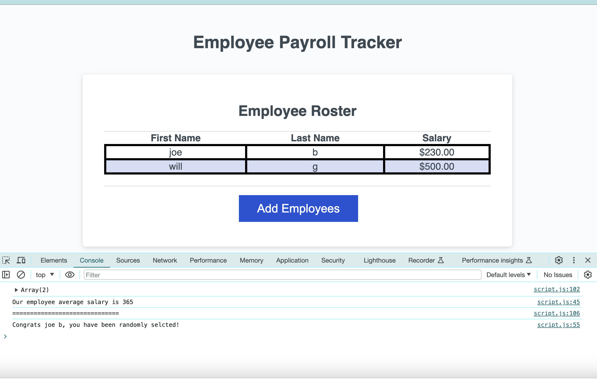

# Employee Payroll Tracker 
## Author: William Gallagher

## Description

This webpage was reformatted to satisfy the User's acceptance criteria as described in the INSTRUCTIONS.md file located in this repository. It is a basic program which prompts the user to input name and salary data about some employees and returns a table containing that data to the browser and some additional information to the browser console.

## Visuals

## Deployment

[Employee Payroll Tracker](https://evildogma.github.io/payroll-tracker/)

## Usage

To use the webpage, click on the "Add Employees" button and then follow the prompts to enter information. If you don't enter anything or it is of the wrong type, the prompt will ask you again. Once you have entered enough information, choose cancle when asked "Enter another employee?" and the program will add the data to the table. Then open the developer tools and view your console to see additional outputs. 

## Credits

- JD Tadlock - Helped we with logical conditions on while loops.

## License

Please refer to the LICENSE in the repo.